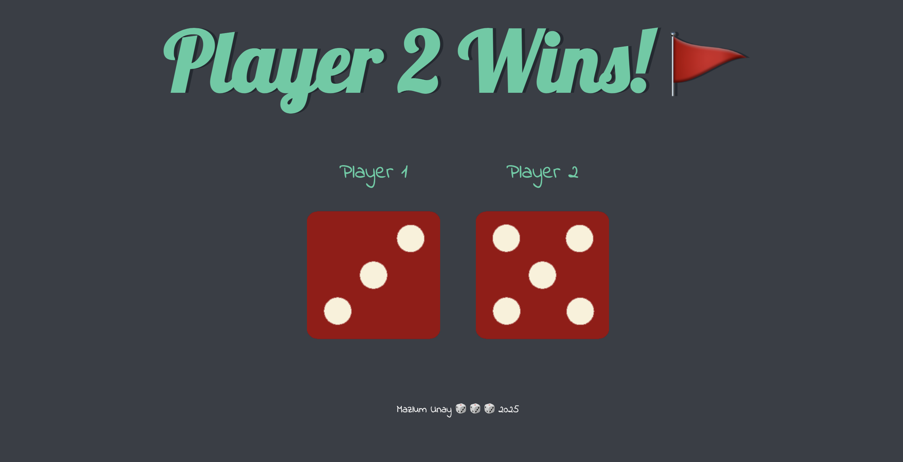

# Dice Rolling Simulator 🎲

A simple and interactive dice rolling application built with HTML, CSS, and JavaScript.

[](https://mazlumunay.github.io/diceRollingProject/)


## Features
- Roll virtual dice with realistic animation
- Responsive design works on all devices
- Clean and intuitive interface
- Instant random results

## Usage
1. Visit the [Live Demo](https://mazlumunay.github.io/diceRollingProject/)
2. Click the "Roll Dice" button
3. View your random dice result
4. Roll again as needed

## Screenshot


## Installation
To run locally:
```bash
git clone https://github.com/mazlumunay/diceRollingProject.git
cd diceRollingProject
open index.html
```

## Technologies
- HTML5
- CSS3
- JavaScript

## License
- MIT License